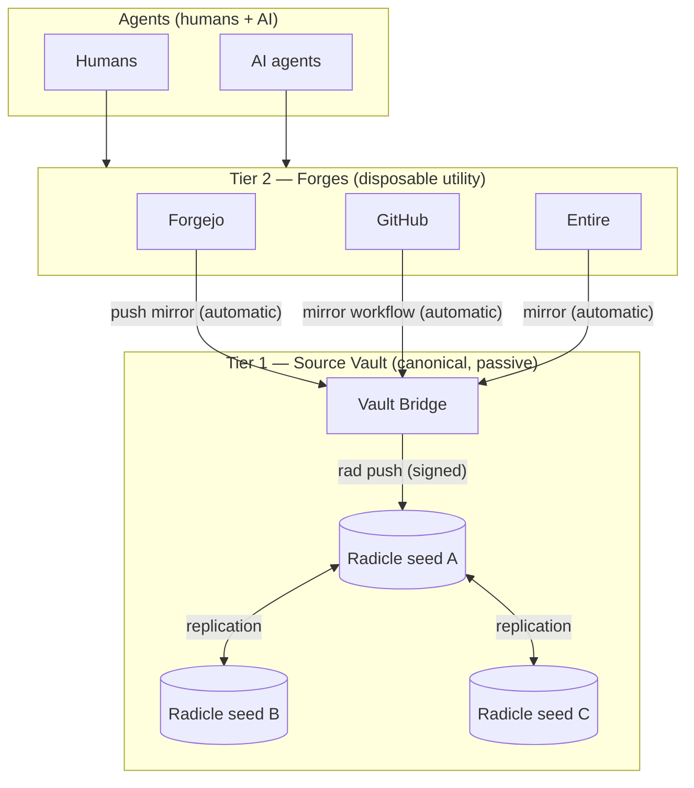
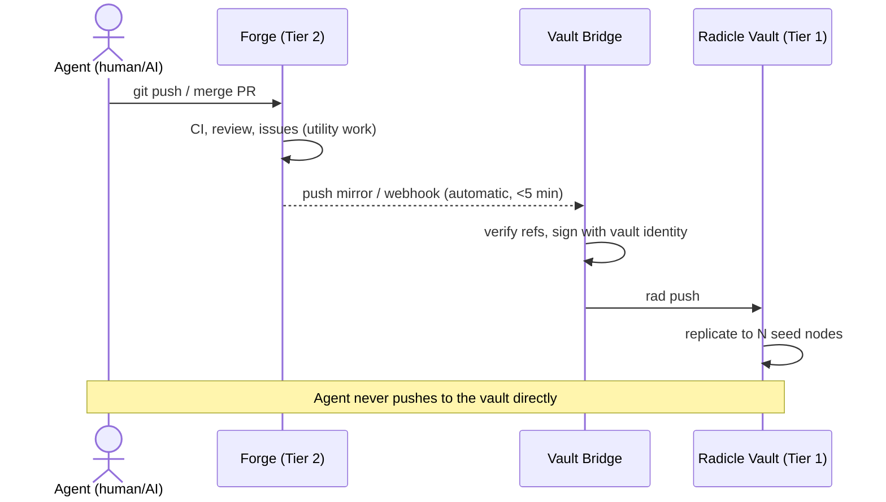

> **Canonical source:** [`docs/superpowers/specs/2026-07-24-source-vault-prd.md`](../../docs/superpowers/specs/2026-07-24-source-vault-prd.md)
> This is a convenience copy for the b4mad-forgejo application dir — if it drifts, the spec wins.

# PRD: Source Vault + Disposable Forges

**Date:** 2026-07-24
**Status:** Draft — for review
**Author:** goern (concept), Claude (write-up)

## 1. Problem

Source code, issues, and CI live inside forge platforms (Forgejo, GitHub,
Entire, …). These platforms are treated as if they were the system of
record, but they are not trustworthy in that role:

- They come and go (pricing, acquisition, policy, self-host fatigue).
- Their databases hold collaboration state (issues, PRs, reviews) that is
  lost or painfully exported on migration.
- Switching cost grows silently with every webhook, action, and issue.

A previous attempt to use Radicle as a backup target failed — not because
of Radicle, but because pushing to it was a **manual habit** ("I keep
forgetting to push / enable it per repo"). Any design that depends on
human discipline for durability is broken by construction.

## 2. Concept

Two tiers with strictly different roles:

| Tier | Name | Role | Lifetime |
|------|------|------|----------|
| 1 | **Source Vault** | Canonical, passive, replicated storage of every repo. Write path is `git push` only. Nobody *works* here. | Decades |
| 2 | **Forges** | Where agents (humans and machines) work: code review, issues, PRs, CI/CD. Utility, replaceable, disposable. | Years, maybe months |

**Agents** — human or AI — only ever touch Tier 2. Tier 1 receives
everything automatically.

### Design principles

1. **Automation, not discipline.** The vault is fed by machinery
   (push mirrors, hooks, a bridge), never by a human remembering to push.
   This is the non-negotiable lesson from the failed first attempt.
2. **The vault is passive.** No CI, no issues UI, no reviews, no force
   pushes from humans. Only `git push` (via the bridge) and `git clone`
   (for recovery/bootstrap).
3. **Disposability test.** At any moment it must be true: *"I could delete
   my account/org on any Tier-2 forge today and lose nothing but
   convenience."* Every feature adopted on a forge is measured against
   this test.
4. **Metadata travels in git.** Code alone in the vault is not enough —
   a forge whose database owns the issues is not disposable. Collaboration
   state must be git-native: beads (`.beads/issues.jsonl`, already in use
   here), or Radicle COBs, or git-bug. Forge-native issues/PRs are
   allowed only as ephemeral working copies.
5. **Zero-touch onboarding.** Creating a repo on a forge automatically
   enrolls it in vault replication. Per-repo manual setup recreates the
   "too many hurdles" failure.

## 3. Push flow

## 4. Requirements

### Functional

- **F1** Every branch and tag of every enrolled repo reaches the vault
  automatically within minutes of landing on any Tier-2 forge.
- **F2** New repos are enrolled automatically (org-level mirror config or
  a reconciler that lists forge repos and creates missing mirrors).
- **F3** The vault stores full history, verifiable integrity
  (signed refs / Radicle identities), replicated to ≥2 physically
  separate nodes.
- **F4** Recovery path: from vault alone, a new Tier-2 forge can be
  fully repopulated (code + git-native issue data) with a script,
  no manual per-repo steps.
- **F5** Replication is monitored: a lagging or failed mirror alerts
  (Prometheus-style metric from the bridge), because silent mirror
  failure equals no vault.

### Non-functional

- **N1** Vault components are boring and self-hosted (fit for rpi5-class
  hardware; Radicle seed nodes are lightweight).
- **N2** No secrets in the vault beyond what is in git already; SOPS
  discipline unchanged.
- **N3** Bridge is stateless and rebuildable from Ansible (this repo's
  collection), no pet configuration.

## 5. Radicle as the vault — fit assessment

**Strengths:** local-first, peer-replicated, cryptographic repo
identities and signed refs, no central operator, seed nodes are cheap.
Philosophically it *is* a passive vault.

**Gaps to close:**

- Forge push-mirrors speak plain git; Radicle wants `rad push` with a
  signing identity. → The **Vault Bridge** closes this: a small service
  (or Tekton pipeline triggered by forge webhook) holding one vault
  identity, doing `git fetch <forge> && rad push`.
- Per-repo `rad init` friction. → The bridge's reconciler does it,
  never a human (F2).
- ⚠️ Radicle COBs for issues would lock metadata to Radicle tooling.
  Beads is already forge- and vault-agnostic — prefer beads as the
  metadata carrier; treat COBs as optional.

## 6. Alternatives considered

| Option | Verdict |
|--------|---------|
| Entire (or any forge) as the vault | ⚠️ Rejected — violates the two-tier premise; a forge is an operator with a database, i.e. Tier 2 by definition. |
| Bare git server + borg backups | Simple, but single-operator, no signed identities, restore is a fire drill instead of a live replica. Viable fallback if Radicle proves too rough. |
| Client-side double push (two push URLs on `origin`) | Rejected — per-repo, per-clone manual setup; the exact discipline trap again. |
| Radicle-only (no Tier 2) | Rejected — agents need forge UX: PRs, CI, review tooling. |

## 7. MVP and phases

1. **Phase 0 — prove the bridge:** one repo (this one), Forgejo push
   mirror → bridge → `rad push` to a single self-hosted seed node.
2. **Phase 1 — fleet:** reconciler enrolls all Forgejo repos; second
   seed node (different site); Prometheus metrics + alert on mirror lag.
3. **Phase 2 — multi-forge:** GitHub/Entire repos mirrored in via the
   same bridge; recovery script (F4) tested by actually rebuilding a
   forge org from the vault.

## 8. Open questions

1. Where do the ≥2 seed nodes live? (rpi5 is one candidate; second must
   be a different site/failure domain.)
2. Does the bridge run as a webhook-triggered Tekton pipeline (existing
   infra) or a small always-on daemon with a poll loop?
3. Are release artifacts (containers, binaries) in scope, or is this
   strictly source? (Proposal: strictly source; artifacts are
   rebuildable.)
4. Private repos: Radicle supports private repos, but replication
   semantics differ — verify before enrolling anything non-public.
